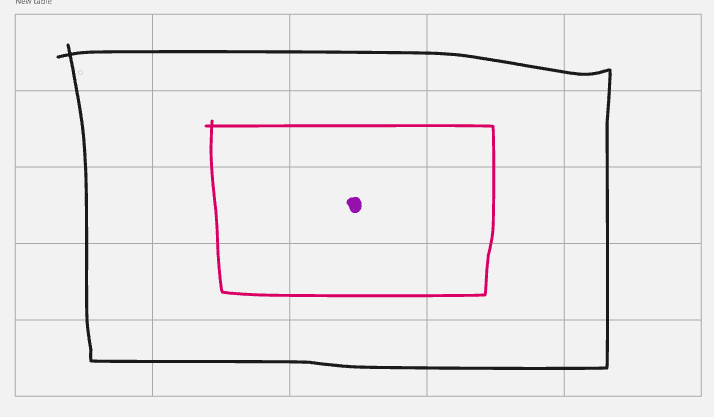
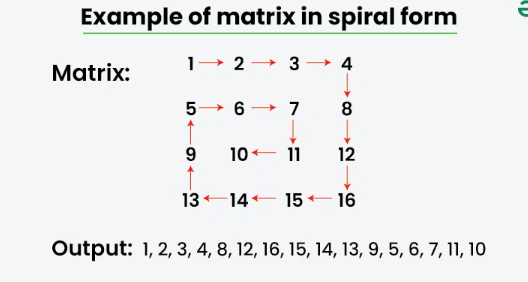

# Spiral Matrix  




Problem : 54. Spiral Matrix( Leetcode )
``` 
class Solution {
public:
    vector<int> spiralOrder(vector<vector<int>>& matrix) {
        if(matrix.size() == 0)
            return {};
        int m = matrix.size();
        int n = matrix[0].size();
        vector<int> result;
        int top   = 0;
        int down  = m-1;
        int left  = 0;
        int right = n-1;
        
        int id = 0;
        //id
        //0   -> left  to right
        //1   -> top   to down
        //2   -> right to left
        //3   -> down  to top

        while(top <= down && left <= right) {
            //left to right
            if(id == 0) {
                for(int i = left; i<=right; i++) {
                    result.push_back(matrix[top][i]);
                }
                top++;
            }
            
            //top to down
            if(id == 1) {
                for(int i = top; i<=down; i++) {
                    result.push_back(matrix[i][right]);
                }
                right--;
            }
            
            //right to left
            if(id == 2) {
                for(int i = right; i>=left; i--) {
                    result.push_back(matrix[down][i]);
                }
                down--;
            }
            
            //down to top
            if(id == 3) {
                for(int i = down; i>=top; i--) {
                    result.push_back(matrix[i][left]);
                }
                left++;
            }
            
            id = (id+1)%4;
        }
        return result;
    }
};
```
Problem : B - Make Target ( Atcoder)
```
#include <bits/stdc++.h>
using namespace std;

int main() {
    ios_base::sync_with_stdio(false);
    cin.tie(nullptr);

    int n;
    cin >> n;
    vector<vector<char>> matrix(n, vector<char>(n));

    int top = 0, down = n - 1, left = 0, right = n - 1;
    int x = 0, id = 0;
    char ch;

    while (top <= down && left <= right) {
        ch = (x == 0) ? '#' : '.';

        // Left to right
        if (id == 0) {
            for (int i = left; i <= right; i++) {
                matrix[top][i] = ch;
            }
            top++;
        }

        // Top to bottom
        else if (id == 1) {
            for (int i = top; i <= down; i++) {
                matrix[i][right] = ch;
            }
            right--;
        }

        // Right to left
        else if (id == 2) {
            for (int i = right; i >= left; i--) {
                matrix[down][i] = ch;
            }
            down--;
        }

        // Bottom to top
        else if (id == 3) {
            for (int i = down; i >= top; i--) {
                matrix[i][left] = ch;
            }
            left++;
        }
        id++;
        if ( id == 4 ){
            x = (x + 1) % 2;
            id = 0 ;
        }
    }

    for (int i = 0; i < n; i++) {
        for (int j = 0; j < n; j++) {
            cout << matrix[i][j];
        }
        cout << '\n';
    }

    return 0;
}
```

