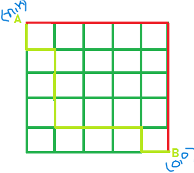
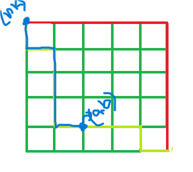

## From \((0,0)\) to point \((n,k)\)


The formula for counting the number of shortest lattice paths from point \((0,0)\) to point \((n,k)\) is the binomial coefficient \({n+k \choose n}\) or \({n+k \choose k}\). This is calculated using the formula \(\frac{(n+k)!}{n!k!}\). This formula represents the total number of unique paths of a specific length on a grid, where only moves up and right are allowed.

**Formula: \({n+k \choose n}=\frac{(n+k)!}{n!k!}\)**

```cpp
#include <bits/stdc++.h>
using namespace std;

const int MOD = 1e9 + 7;
const int MAXN = 1e6 + 5; // adjust depending on max n
long long fact[MAXN], invfact[MAXN];

// Fast exponentiation: a^b % MOD
long long mod_pow(long long a, long long b) {
    long long res = 1;
    while (b > 0) {
        if (b & 1) res = (res * a) % MOD;
        a = (a * a) % MOD;
        b >>= 1;
    }
    return res;
}

// Precompute factorials and inverse factorials
void precompute_factorials() {
    fact[0] = 1;
    for (int i = 1; i < MAXN; i++)
        fact[i] = (fact[i - 1] * i) % MOD;

    invfact[MAXN - 1] = mod_pow(fact[MAXN - 1], MOD - 2); // Fermat's little theorem
    for (int i = MAXN - 2; i >= 0; i--)
        invfact[i] = (invfact[i + 1] * (i + 1)) % MOD;
}

// nCr % MOD
long long nCr(int n, int r) {
    if (r < 0 || r > n) return 0;
    return fact[n] * invfact[r] % MOD * invfact[n - r] % MOD;
}

int main() {
    ios::sync_with_stdio(false);
    cin.tie(nullptr);

    precompute_factorials();

    int n, r;
    cin >> n >> r;

    cout << nCr(n, r) << "\n";
    return 0;
}
```

## From \((a,b)\) to point \((n,k)\)



1. If your path starts at a different point, like \((a,b)\), and ends at \((n,k)\), you must first find the number of steps needed in each direction.
2. The number of steps to the right is \((n-a)\) and the number of steps up is \((k-b)\).
3. The formula then becomes \({(n-a)+(k-b) \choose n-a}\) or \({(n-a)+(k-b) \choose k-b}\).

```cpp
#include <bits/stdc++.h>
using namespace std;

const int MOD = 1e9 + 7;
const int MAXN = 2e6 + 5; // should be >= (n + k)
long long fact[MAXN], invfact[MAXN];

// Fast exponentiation (a^b % MOD)
long long mod_pow(long long a, long long b) {
    long long res = 1;
    while (b > 0) {
        if (b & 1) res = (res * a) % MOD;
        a = (a * a) % MOD;
        b >>= 1;
    }
    return res;
}

// Precompute factorials and inverse factorials
void precompute() {
    fact[0] = 1;
    for (int i = 1; i < MAXN; i++)
        fact[i] = (fact[i - 1] * i) % MOD;

    invfact[MAXN - 1] = mod_pow(fact[MAXN - 1], MOD - 2);
    for (int i = MAXN - 2; i >= 0; i--)
        invfact[i] = (invfact[i + 1] * (i + 1)) % MOD;
}

// nCr % MOD
long long nCr(int n, int r) {
    if (r < 0 || r > n) return 0;
    return fact[n] * invfact[r] % MOD * invfact[n - r] % MOD;
}

// Number of paths from (a,b) -> (n,k)
long long numPaths(int a, int b, int n, int k) {
    int rightSteps = n - a;
    int upSteps = k - b;
    if (rightSteps < 0 || upSteps < 0) return 0; // invalid direction
    return nCr(rightSteps + upSteps, rightSteps);
}

int main() {
    ios::sync_with_stdio(false);
    cin.tie(nullptr);

    precompute();

    int a, b, n, k;
    cin >> a >> b >> n >> k;

    cout << numPaths(a, b, n, k) % MOD << "\n";
    return 0;
}
```
