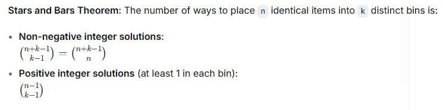
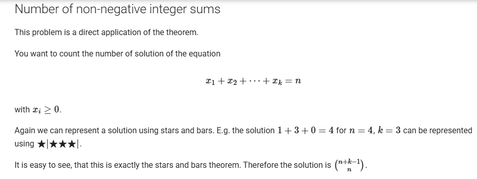
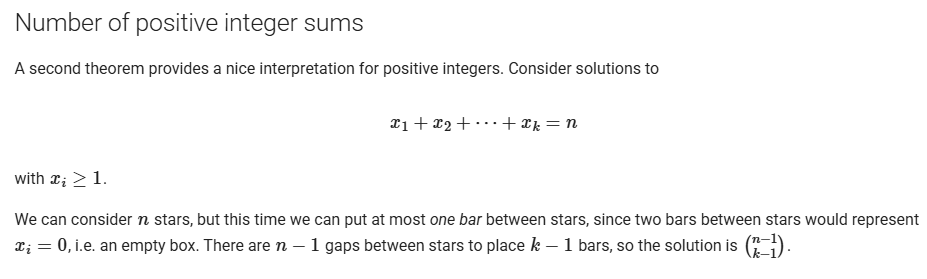
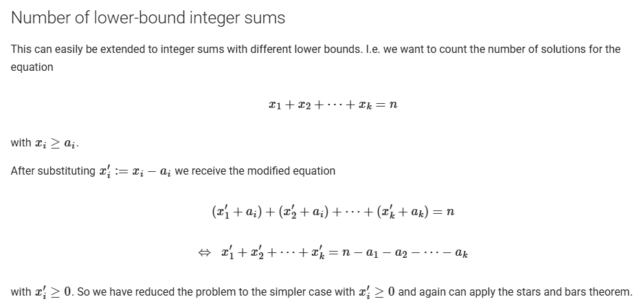

# Stars and Bars

## 1. Fundamental Theorem



## 2. The Four Cases

### Case 1: Non-negative Solutions :



### Case 2: Positive Solutions :



### Case 3: Lower Bound Constraints :


Formula : $\binom{n - \sum a_i + k - 1}{k - 1}$ (if $n \geq \sum a_i$)

### Case 4: Upper Bound Constraints :

Need Inclucion Exclusing principle

## Code :

```cpp
#include<bits/stdc++.h>
using namespace std;

const int N = 1e6 + 9, mod = 1e9 + 7;
int f[N], inv[N], finv[N];

void prec() {
  f[0] = 1;
  for (int i = 1; i < N; i++) {
    f[i] = 1LL * i * f[i - 1] % mod;
  }
  inv[1] = 1;
  for (int i = 2; i < N; i++) {
    inv[i] = (-(1LL * mod / i) * inv[mod % i]) % mod;
    inv[i] = (inv[i] + mod) % mod;
  }
  finv[0] = 1;
  for (int i = 1; i < N; i++) {
    finv[i] = 1LL * inv[i] * finv[i - 1] % mod;
  }
}

int ncr(int n, int r) {
  if (n < r || n < 0 || r < 0) return 0;
  return 1LL * f[n] * finv[n - r] % mod * finv[r] % mod;
}

// Case 1: xi >= 0
int stars_and_bars_non_negative(int n, int k) {
  return ncr(n + k - 1, k - 1);
}
// Case 2: xi >= 1
int stars_and_bars_positive(int n, int k) {
  return ncr(n - 1, k - 1);
}


// Case 3: xi >= ai (lower bounds)
int stars_and_bars_lower_bounds(int n, vector<int> &a) {
    int k = a.size();
    long long sum = 0;
    for ( auto it : a ){
        sum += it;
    }
    n -= sum;
    if (n < 0) return 0;
    return ncr(n + k - 1, k - 1);
}

// Case : xi >= 0 and sum <= n
int stars_and_bars_less_equal(int n, int k) {
  return ncr(n + k, k);
}
signed main() {
  ios_base::sync_with_stdio(0);
  cin.tie(0);

  prec();

  int tc; cin >> tc ;
  for ( int i = 0 ; i < tc ; i++ ){

    int type;
    cin >> type;

    if (type == 1) { // xi >= 0
      int n, k; cin >> n >> k;
      cout << stars_and_bars_non_negative(n, k) << '\n';
    }
    else if (type == 2) { // xi >= 1
      int n, k; cin >> n >> k;
      cout << stars_and_bars_positive(n, k) << '\n';
    }
    else if (type == 3) { // xi >= ai
        int n, k; cin >> n >> k;
        vector<int> a(k);
        for (int i = 0; i < k; i++) cin >> a[i];
        cout << stars_and_bars_lower_bounds(n, a) << '\n';
    }
    else { // xi >= 0, sum <= n
        int n, k; cin >> n >> k;
        cout << stars_and_bars_less_equal(n, k) << '\n';
    }
  }

  return 0;
}
```
