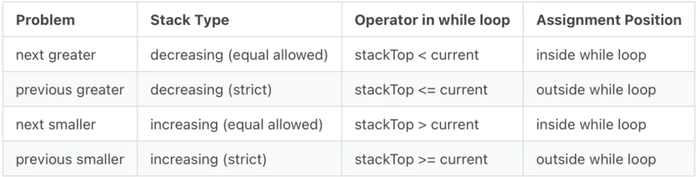

Monotonic stack is a data structure and algorithmic technique used to solve a class of problems known as “monotonic stack problems.” These problems typically involve finding the nearest smaller or larger element in a sequence for each element in the same sequence.

The monotonic stack is a stack that maintains elements in either non-increasing or non-decreasing order from the bottom to the top. In other words, for a monotonic increasing stack, the elements are arranged in ascending order from the bottom to the top, while for a monotonic decreasing stack, they are arranged in descending order.

**The key idea behind monotonic stack problems is to use the stack to keep track of elements that have not yet found their desired smaller or larger element. As we iterate through the elements of the sequence, we can efficiently find the nearest smaller or larger element by comparing the current element with the elements present in the stack.**

## Quick Note:

Time Complexity — O(n) → linear, because due to four main operations: comparing the current element with the stack’s top element (while conditional) constant, pushing an item into the stack constant, comparing the stack’s top element with the current element being iterated (while conditional again) constant, and popping an item out of the stack constant.

Space Complexity — O(n) → linear, because an external stack is being used, which can hold all the elements of the array.

## A General Template

```cpp
#include <bits/stdc++.h>
using namespace std;

void monotonic(vector<int>& arr) {
    vector<int> stack; // using vector as a stack

    for (int i = 0; i < (int)arr.size(); i++) {
        // adjust operator as needed (>=, <=, etc.)
        while (!stack.empty() && stack.back() >= arr[i]) {
            int curr = stack.back();
            stack.pop_back();
            // do something with curr
        }

        if (!stack.empty()) {
            // do something if stack isn't empty - optional
        }
        stack.push_back(arr[i]); // insert current element
    }
}

int main() {
    vector<int> arr = {3, 1, 4, 2, 5};
    monotonic(arr);
    return 0;
}
```

### Essentially 4 types of problems exist that can be addressed using this template.



## 1. Code

```cpp
#include <bits/stdc++.h>
using namespace std;

// 1. Next Greater Element
vector<int> nextGreaterElements(vector<int>& arr) {
    int n = arr.size();
    vector<int> result(n, -1);
    stack<int> st; // Stores indices

    for (int i = 0; i < n; ++i) {
        while (!st.empty() && arr[i] > arr[st.top()]) {
            result[st.top()] = arr[i];
            st.pop();
        }
        st.push(i);
    }

    return result;
}

// 2. Previous Greater Element
vector<int> previousGreaterElements(vector<int>& arr) {
    int n = arr.size();
    vector<int> result(n, -1);
    stack<int> st; // Stores indices

    for (int i = 0; i < n; ++i) {
        while (!st.empty() && arr[st.top()] <= arr[i]) {
            st.pop();
        }
        if (!st.empty()) result[i] = arr[st.top()];
        st.push(i);
    }

    return result;
}

// 3. Next Smaller Element
vector<int> nextSmallerElements(vector<int>& arr) {
    int n = arr.size();
    vector<int> result(n, -1);
    stack<int> st; // Stores indices

    for (int i = 0; i < n; ++i) {
        while (!st.empty() && arr[i] < arr[st.top()]) {
            result[st.top()] = arr[i];
            st.pop();
        }
        st.push(i);
    }

    return result;
}

// 4. Previous Smaller Element
vector<int> previousSmallerElements(vector<int>& arr) {
    int n = arr.size();
    vector<int> result(n, -1);
    stack<int> st; // Stores indices

    for (int i = 0; i < n; ++i) {
        while (!st.empty() && arr[st.top()] >= arr[i]) {
            st.pop();
        }
        if (!st.empty()) result[i] = arr[st.top()];
        st.push(i);
    }

    return result;
}

// Helper to print results
void printVector(string name, vector<int>& v) {
    cout << name << ": ";
    for (int val : v) cout << val << " ";
    cout << endl;
}

// Main function
int main() {
    vector<int> arr = {13, 8, 1, 5, 2, 5, 9, 7, 6, 12};

    vector<int> nge = nextGreaterElements(arr);
    vector<int> pge = previousGreaterElements(arr);
    vector<int> nse = nextSmallerElements(arr);
    vector<int> pse = previousSmallerElements(arr);

    printVector("Next Greater       ", nge);
    printVector("Previous Greater   ", pge);
    printVector("Next Smaller       ", nse);
    printVector("Previous Smaller   ", pse);

    return 0;
}
```
