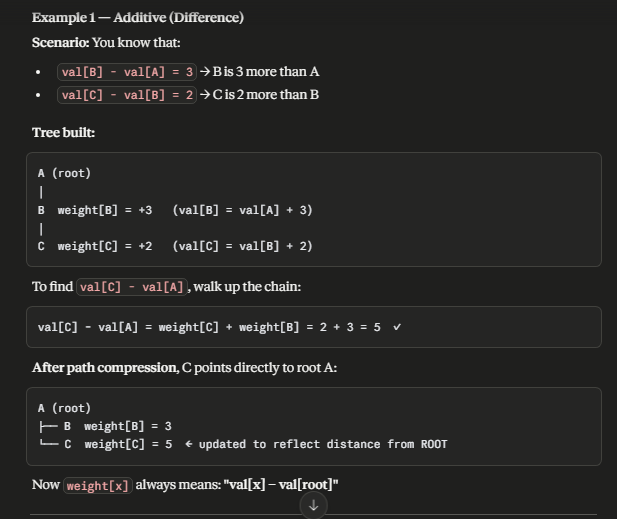
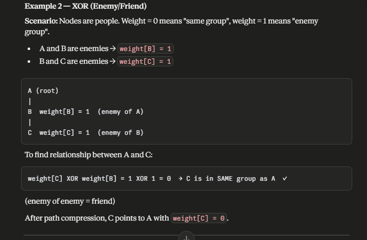
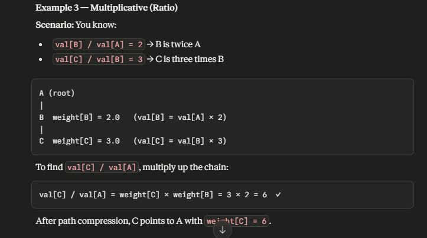

# Weighted DSU (Disjoint Set Union)

Weighted DSU (also called Weighted Union-Find) extends the classic DSU by storing weights on edges between nodes and their parents, enabling you to answer queries about the relationship between any two nodes in the same component.





## Note

- weight[x] always answers: "How does x relate to its current parent?"
- No path compression happen

## Practice Problem

[C. Experience](https://codeforces.com/edu/course/2/lesson/7/1/practice/contest/289390/problem/C)

## Code

```cpp
#include <bits/stdc++.h>
using namespace std;
#define int long long

const int mx = 2e5+123;
struct Disjoint_set_union{
    int Parent[mx], Size[mx] , xp[mx];
    void Init(int n){
        for (int i = 0; i <= n; i++){
            Parent[i] = i;
            Size[i] = 1;
        }
    }
    int Find(int v){ // no path compression
        if (v == Parent[v]) return v;
        return Find(Parent[v]);
    }
    bool Union(int u, int v){
        int root_u = Find(u);
        int root_v = Find(v);
        if (root_u != root_v){
            if (Size[root_u] < Size[root_v]){
                swap(root_u, root_v);
            }
            Parent[root_v] = root_u;
            Size[root_u] += Size[root_v];
            xp[root_v] -= xp[root_u];
            return true;
        }
        return false;
    }
    int Get(int a ){ // backtrack to root using all parent
        if ( a == Parent[a]) return xp[a];
        return xp[a] + Get(Parent[a]);
    }
} dsu;

void solve() {
    int n , m ;
    cin >> n >> m ;
    dsu.Init(n);
    for ( int i = 0 ; i < m ; i++ ){
        string s ; cin >> s ;
        if ( s == "join"){
            int u , v ;
            cin >> u >> v;
            dsu.Union(u , v);
        }
        else if ( s == "add"){
            int u , val ;
            cin >> u >> val;
            dsu.xp[dsu.Find(u)]+= val;
        }
        else{
            int u ; cin >> u;
            cout << dsu.Get(u) << '\n';
        }
    }
}

int32_t main() {
    ios_base::sync_with_stdio(false);
    cin.tie(NULL);

    int tests = 1;
    // cin >> tests;
    for ( int tc = 1 ; tc <= tests ; tc++ ){
        solve();
    }
    return 0;
}
```
