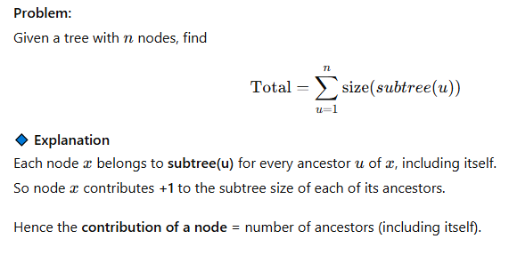
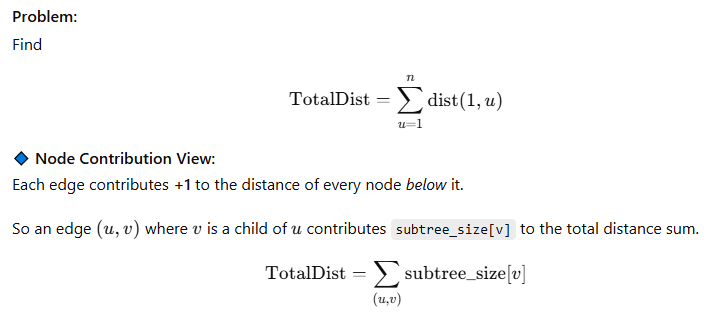
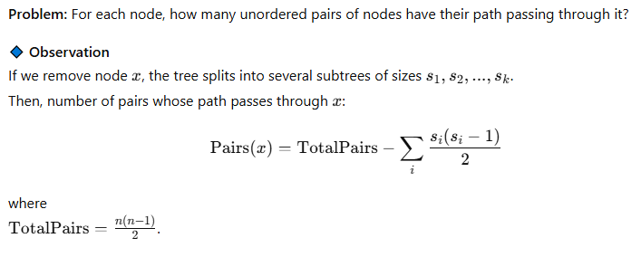
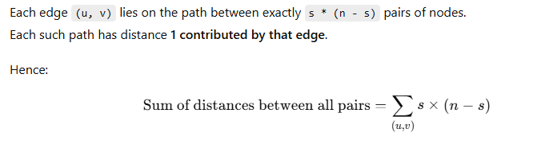

## Rerooting DP

When you root a tree at a node (say 1),
you can compute something for all nodes (like subtree sums).
But when you change the root — recomputing everything with DFS is expensive.

Rerooting DP allows you to compute **results for all roots in O(N)**, not O(N²).

## Example Problem

### Sum of Distances in a Tree

For each node u, find the sum of distances from u to every other node.

```cpp
int subtree_size[N];
long long dist_sum[N];
vector<int> g[N];

void dfs1(int u, int p, int depth) {
    subtree_size[u] = 1;
    dist_sum[1] += depth;
    for (auto v : g[u]) {
        if (v == p) continue;
        dfs1(v, u, depth + 1);
        subtree_size[u] += subtree_size[v];
    }
}
```

### Use Rerooting to compute dist_sum[v] for all nodes

**Observation:** <br>
When you move the root from u → v (where v is a child of u):

1. Nodes in v’s subtree become 1 unit closer
2. All other nodes become 1 unit farther

**Formula**

```md
dist_sum[v] = dist_sum[u] - subtree_size[v] + (n - subtree_size[v])
```

```cpp
#include <bits/stdc++.h>
using namespace std;

const int N = 1e5 + 5;
vector<int> g[N];
int n;
int subtree_size[N];
long long dist_sum[N];

void dfs1(int u, int p, int depth) {
    subtree_size[u] = 1;
    dist_sum[1] += depth;
    for (auto v : g[u]) {
        if (v == p) continue;
        dfs1(v, u, depth + 1);
        subtree_size[u] += subtree_size[v];
    }
}

void dfs2(int u, int p) {
    for (auto v : g[u]) {
        if (v == p) continue;
        dist_sum[v] = dist_sum[u] - subtree_size[v] + (n - subtree_size[v]);
        dfs2(v, u);
    }
}

int main() {
    cin >> n;
    for (int i = 0; i < n - 1; i++) {
        int u, v; cin >> u >> v;
        g[u].push_back(v);
        g[v].push_back(u);
    }

    dfs1(1, -1, 0);
    dfs2(1, -1);

    for (int i = 1; i <= n; i++){
        cout << "Sum of distances from node " << i << " " << dist_sum[i] << "\n";
    }
}
```

## Node Contribution of Tree

Each node can “contribute” some value to the overall result (sum, distance, pair count, etc.)
Instead of thinking in terms of pairs (u, v), we think:

`“What part of the final answer is added because of this node?”`

### Example 1: Sum of Subtree Sizes of All Nodes



```cpp
#include <bits/stdc++.h>
using namespace std;

const int N = 1e5+5;
vector<int> g[N];
int subtree_size[N];
int n;

void dfs(int u, int p) {
    subtree_size[u] = 1;
    for (auto v : g[u]) {
        if (v == p) continue;
        dfs(v, u);
        subtree_size[u] += subtree_size[v];
    }
}

int main() {
    cin >> n;
    for (int i=0;i<n-1;i++){
        int u,v; cin >> u >> v;
        g[u].push_back(v);
        g[v].push_back(u);
    }
    dfs(1,-1);

    long long total = 0;
    for(int i=1;i<=n;i++) {
        total += subtree_size[i];
    }
    cout << total << '\n';
}
```

### Example 2: Sum of Distances from Root to All Nodes



```cpp
#include <bits/stdc++.h>
using namespace std;

const int N = 1e5+5;
vector<int> g[N];
int subtree_size[N];
long long totalDist = 0;

void dfs(int u, int p, int depth) {
    subtree_size[u] = 1;
    totalDist += depth;
    for (auto v : g[u]) {
        if (v == p) continue;
        dfs(v, u, depth + 1);
        subtree_size[u] += subtree_size[v];
    }
}

int main(){
    int n; cin >> n;
    for(int i=0;i<n-1;i++){
        int u,v; cin >> u >> v;
        g[u].push_back(v);
        g[v].push_back(u);
    }
    dfs(1,-1,0);
    cout << totalDist << '\n';
}
```

### Example 3: Number of Pairs (u, v) Whose Path Passes Through Node x



```cpp
#include <bits/stdc++.h>
using namespace std;

const int N = 1e5+5;
vector<int> g[N];
int subtree_size[N];
int n;
long long ans[N];

void dfs(int u, int p) {
    subtree_size[u] = 1;
    vector<int> child_sizes;

    for (auto v : g[u]) {
        if (v == p) continue;
        dfs(v, u);
        subtree_size[u] += subtree_size[v];
        child_sizes.push_back(subtree_size[v]);
    }

    // size of remaining part (the component above u)
    if (p != -1) child_sizes.push_back(n - subtree_size[u]);

    // now calculate pairs(u)
    long long total_pairs = 1LL * n * (n - 1) / 2;
    long long inside = 0;
    for (auto s : child_sizes) inside += 1LL * s * (s - 1) / 2;

    ans[u] = total_pairs - inside;
}

int main() {
    ios::sync_with_stdio(false);
    cin.tie(nullptr);

    cin >> n;
    for (int i = 0; i < n - 1; i++) {
        int u, v;
        cin >> u >> v;
        g[u].push_back(v);
        g[v].push_back(u);
    }

    dfs(1, -1);

    for (int i = 1; i <= n; i++) {
        cout << "Node " << i << ": " << ans[i] << " pairs\n";
    }
}
```

## Edge Contribution on Tree 
When a tree edge (u, v) is removed, the tree splits into **two connected components.**

Each pair (a, b) of nodes whose path uses that edge must have: 
1. one node in the component of u, and
2. one node in the component of v.

So that edge is used by all cross-pairs between those two components.

### Example 1: Count Total Pairs of Nodes’ Paths that Pass through Each Edge
```Contribution of Edge (u,v) = subtree_size[v]×(n−subtree_size[v])```

```cpp
#include <bits/stdc++.h>
using namespace std;

const int N = 1e5+5;
vector<int> g[N];
int subtree_size[N];
int n;

void dfs(int u, int p) {
    subtree_size[u] = 1;
    for (auto v : g[u]) {
        if (v == p) continue;
        dfs(v, u);
        subtree_size[u] += subtree_size[v];
    }
}

int main() {
    ios::sync_with_stdio(false);
    cin.tie(nullptr);
    
    cin >> n;
    for (int i = 0; i < n - 1; i++) {
        int u, v;
        cin >> u >> v;
        g[u].push_back(v);
        g[v].push_back(u);
    }

    dfs(1, -1);

    long long total_pairs = 0;
    for (int u = 1; u <= n; u++) {
        for (auto v : g[u]) {
            if (v > u) { // ensure edge counted once
                int sz = min(subtree_size[v], n - subtree_size[v]);
                total_pairs += 1LL * sz * (n - sz);
            }
        }
    }

    cout << "Total pairs whose path passes through some edge: " << total_pairs << '\n';
}
```
### Example 2: Compute the sum of distances between all pairs of nodes

```cpp
#include <bits/stdc++.h>
using namespace std;

const int N = 1e5+5;
vector<int> g[N];
int subtree_size[N];
int n;
long long totalDist = 0;

void dfs(int u, int p) {
    subtree_size[u] = 1;
    for (auto v : g[u]) {
        if (v == p) continue;
        dfs(v, u);
        subtree_size[u] += subtree_size[v];
        long long s = subtree_size[v];
        totalDist += s * (n - s); // edge contribution
    }
}

int main() {
    cin >> n;
    for (int i = 0; i < n - 1; i++) {
        int u, v; cin >> u >> v;
        g[u].push_back(v);
        g[v].push_back(u);
    }

    dfs(1, -1);
    cout << "Total sum of distances between all pairs = " << totalDist << '\n';
}
```

