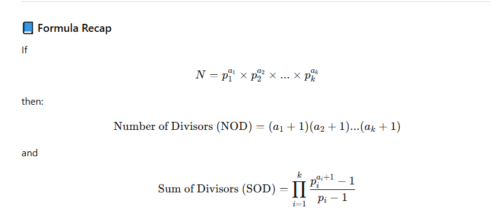

# Number of Devisor (NOD) & Sum of Devisor (SOD)

## Resources :

[Article 1](https://cp-algorithms.com/algebra/divisors.html)



```cpp
#include <bits/stdc++.h>
using namespace std;

#define int long long
const int MX = 1e6;
int spf[MX + 1];
vector<int> primes;

void computeSPF() {
    for (int i = 2; i <= MX; i++) {
        if (!spf[i]) {
            spf[i] = i;
            primes.push_back(i);
        }
        for (int p : primes) {
            if (p > spf[i] || 1LL * i * p > MX) break;
            spf[i * p] = p;
        }
    }
}

int  NOD(int  n) {
    int  res = 1;
    for (int  p : primes) {
        if (p * p > n) break;
        int cnt = 0;
        while (n % p == 0) {
            n /= p;
            cnt++;
        }
        res *= (cnt + 1);
    }
    if (n > 1) res *= 2;
    return res;
}


int SOD(int n) {
    int res = 1;
    for (int p : primes) {
        if (p * p > n) break;
        if (n % p == 0) {
            int term = 1;
            int pe = 1;
            while (n % p == 0) {
                n /= p;
                pe *= p;
                term += pe;
            }
            res *= term;
        }
    }
    if (n > 1) {
        res *= (1 + n);
    }
    return res;
}

signed main() {
    ios::sync_with_stdio(false);
    cin.tie(nullptr);

    computeSPF();

    int n ; cin >> n ;
    cout << NOD(n) << '\n';
    cout << SOD(n) << '\n';

    return 0;
}

```

Note : Best time to use when test case is big and need precompute.
[Trailing Zeroes (I)](https://lightoj.com/problem/trailing-zeroes-i)
