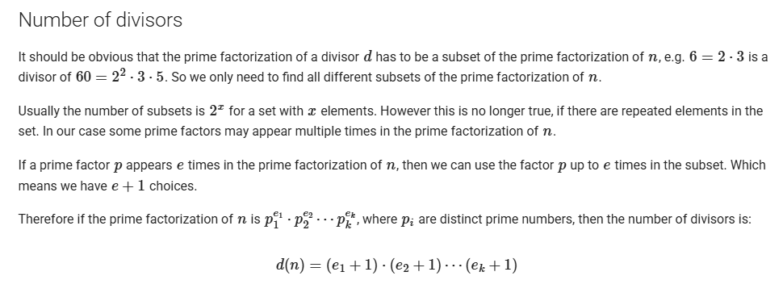
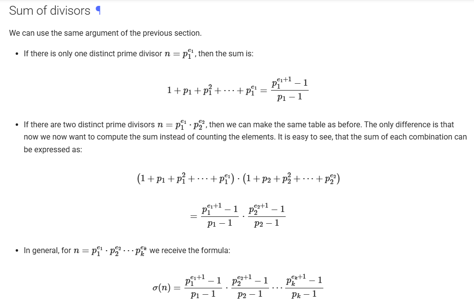

# Number of Devisor (NOD) & Sum of Devisor (SOD)

## Resources :

[Article 1](https://cp-algorithms.com/algebra/divisors.html)




```cpp
#include <bits/stdc++.h>
using namespace std;

#define int long long
const int mx = 1e6;
int spf[mx + 1];
vector<int> primes;

void computeSPF() {
    for (int i = 2; i <= mx; ++i) {
        if (spf[i] == 0) {
            spf[i] = i;
            primes.push_back(i);
        }
        for (int p : primes) {
            if (p > spf[i] || i * p > mx) break;
            spf[i * p] = p;
        }
    }
}

vector<int> getPFactor(int val) {
    vector<int> tmp;
    while (val > 1) {
        int p = spf[val];
        while (val % p == 0) {
            tmp.push_back(p);
            val /= p;
        }
    }
    return tmp;
}

int NOD( int n ){
    vector<int> pf = getPFactor(n);
    map<int,int>mp;
    for ( auto it : pf){
        mp[it]++;
    }

    int val = 1 ;
    for (auto[p,ei] : mp){
        val = val *1ll * (ei+1);
    }
    return val;
}


int power(int a, int b) {
    int res = 1;
    while (b > 0) {
        if (b & 1) res *= a;
        a *= a;
        b >>= 1;
    }
    return res;
}

int SOD(int n) {
    vector<int> pf = getPFactor(n);
    map<int,int> mp;
    for (auto it : pf) {
        mp[it]++;
    }

    int sum = 1;
    for (auto [p, e] : mp) {
        // formula
        int term = (power(p, e + 1) - 1) / (p - 1);
        sum *= term;
    }
    return sum;
}

signed main() {
    ios_base::sync_with_stdio(false);
    cin.tie(nullptr);

    computeSPF();
    int n ; cin >> n ;

    cout << NOD(n) << '\n';
    cout << SOD(n) << '\n';

    return 0;
}
```

Note : Best time to use when test case is big and need precompute.
[Trailing Zeroes (I)](https://lightoj.com/problem/trailing-zeroes-i)
