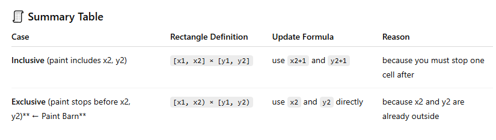

[USACO-919](https://vjudge.net/problem/USACO-919)

```cpp
#include <bits/stdc++.h>
using namespace std;

#define int long long
const int MX = 1002;
int diff[MX][MX];
int pre[MX][MX];

signed main() {
    ios::sync_with_stdio(false);
    cin.tie(nullptr);

    int N, K;
    cin >> N >> K;

    for (int i = 1; i <= N; i++) {
        int x1, y1, x2, y2; // 0 based index
        cin >> x1 >> y1 >> x2 >> y2;

        x1++, y1++, x2++, y2++; // converting 1 based index

        diff[x1][y1] += 1;
        diff[x2][y1] -= 1;
        diff[x1][y2] -= 1;
        diff[x2][y2] += 1;
    }

    int ans = 0;
    for (int i = 1; i <= 1001; i++) {
        for (int j = 1; j <= 1001; j++) {
            pre[i][j] = diff[i][j] + pre[i-1][j] + pre[i][j-1] - pre[i-1][j-1];
            if (pre[i][j] == K) ans++; // based on condition
        }
    }

    cout << ans << "\n";
    return 0;
}
```

[Cherry and Bits](https://www.codechef.com/problems/CENS20A)
( General 2D diffrence array code )

```cpp
#include <bits/stdc++.h>
using namespace std;

const int mx = 1000 + 12;
#define int long long
signed main() {
    ios_base::sync_with_stdio(false);
    cin.tie(nullptr);

    int n, m;
    cin >> n >> m;
    vector<vector<char>> v(n + 2, vector<char>(m + 2, 0));

    for (int i = 1; i <= n; i++) {
        for (int j = 1; j <= m; j++) {
            cin >> v[i][j];
        }
    }

    vector<vector<int>> diff(n + 3, vector<int>(m + 3, 0));
    int q;
    cin >> q;
    while (q--) {
        int x1 , y1 , x2 , y2 ;
        cin >> x1 >> y1 >> x2 >> y2;

        diff[x1][y1] += 1;
        diff[x2 + 1][y1] -= 1;
        diff[x1][y2 + 1] -= 1;
        diff[x2 + 1][y2 + 1] += 1;
    }

    for (int i = 1; i <= n; i++) {
        for (int j = 1; j <= m; j++) {
            diff[i][j] += diff[i - 1][j] + diff[i][j - 1] - diff[i - 1][j - 1];
        }
    }

    for (int i = 1; i <= n; i++) {
        for (int j = 1; j <= m; j++) {
            if (diff[i][j] % 2){
                if (v[i][j] == '1') {
                    v[i][j] = '0';
                }
                else {
                    v[i][j] = '1';
                }
            }

        }
    }

    for (int i = 1; i <= n; i++) {
        for (int j = 1; j <= m; j++) {
            cout << v[i][j];
        }
        cout << '\n';
    }

    return 0;
}
```
