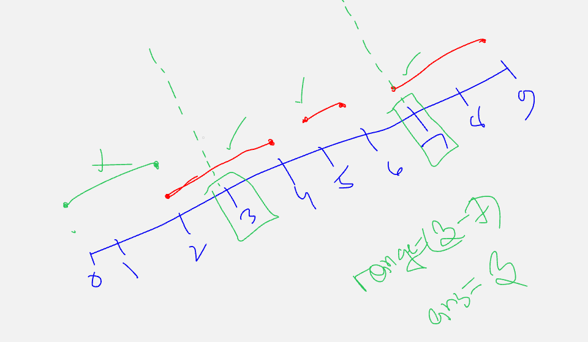

[Problem Link ](https://codeforces.com/contest/2014/problem/D)



Code :
```cpp
#include<bits/stdc++.h>
using namespace std ;

#define int long long 
signed main()
{
    ios_base::sync_with_stdio(false);
    cin.tie(nullptr);
    
    int tc ; cin>> tc ;
    for ( int i = 1 ; i <= tc ; i++ ){
        int n , d , k ;
        cin >> n >> d >> k ;

        int st[n+2] ={0};
        int en[n+2] ={0};

        for ( int i = 1 ; i <= k ; i++ ){
           int l , r ;
           cin >> l >> r ;
           st[l]++;
           en[r]++;
        }

        for ( int i = 1 ; i <= n ; i++ ){
           st[i] += st[i-1];
           en[i] += en[i-1];
        }

        int mn = LLONG_MAX , mx = LLONG_MIN;
        int mnInd = -1 , mxInd = -1 ;
        for ( int i = 1 ; i <= n-(d-1) ; i++ ){
           int cnt = st[i+(d-1)] - en[i-1];
           if ( cnt > mx ){
             mx = cnt ;
             mxInd = i ;
           }
           if ( cnt < mn ){
            mn = cnt ;
            mnInd = i;
           }
        }

        cout << mxInd << " " << mnInd << '\n';
    }
    
    return 0 ;
}
```