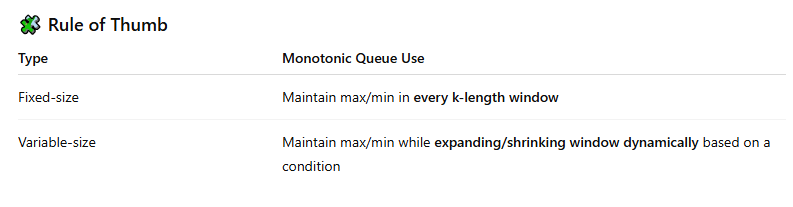

## Application :



1. Maintain max/min in every k-length window :

```cpp
#define int long long
vector<int> slidingWindowMax(const vector<int>& a, int k) {
    int n = a.size();
    deque<int> dq;
    vector<int> res

    for (int i = 0; i < k; i++) {
        // pushing decresing order (i.e, 5 4 3..)
        while (!dq.empty() && a[dq.back()] < a[i]) {
            dq.pop_back();
        }
        dq.push_back(i);
    }
    res.push_back(a[dq.front()]);

    for (int i = k; i < n; i++) {

        // out
        while (!dq.empty() && dq.front() <= i - k) {
            dq.pop_front();
        }

        // in
        while (!dq.empty() && a[dq.back()] < a[i]) {
            dq.pop_back();
        }
        dq.push_back(i);

        res.push_back(a[dq.front()]);
    }
    return res;
}
```

2. Longest Subarray / Window with Absolute Difference ≤ K (max - min ≤ K)

```cpp
#define int long long
int longestSubarrayAbsDiffLEK(const vector<int>& a, int k) {
    deque<int> mx, mn;
    int l = 0, ans = 0;
    int n = a.size();

    for (int r = 0; r < n; r++) {

        // inserting decresing order
        while (!mx.empty() && a[mx.back()] < a[r]) {
            mx.pop_back();
        }
        mx.push_back(r);

        // inserting incresing order
        while (!mn.empty() && a[mn.back()] > a[r]) {
            mn.pop_back();
        }
        mn.push_back(r);

        while (a[mx.front()] - a[mn.front()] > k) {
            if (mx.front() == l) mx.pop_front();
            if (mn.front() == l) mn.pop_front();
            l++;
        }
        ans = max(ans, r - l + 1);
    }
    return ans;
}
```
