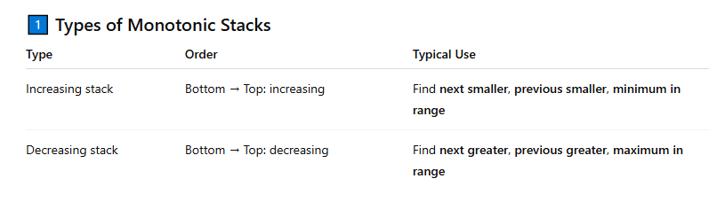

## Application : 


1. Previous Smaller / Greater 
```cpp
vector<int> prevSmaller(const vector<int>& a) {
    int n = a.size();
    vector<int> res(n, -1); // -1 if no previous smaller
    stack<int> st; 
    for (int i = 0; i < n; i++) {
        while (!st.empty() && a[st.top()] >= a[i]) {
            st.pop(); // change >= to <= for prev greater
        }
        if (!st.empty()) {
            res[i] = st.top();
        }
        st.push(i);
    }
    return res;
}
```

2. Next Smaller / Greater 
```cpp
vector<int> nextSmaller(const vector<int>& a) {
    int n = a.size();
    vector<int> res(n, n); 
    stack<int> st;
    for (int i = 0; i < n; i++) {
        while (!st.empty() && a[i] < a[st.top()]) {
            res[st.top()] = i;
            st.pop();
        }
        st.push(i);
    }
    return res;
}
```
