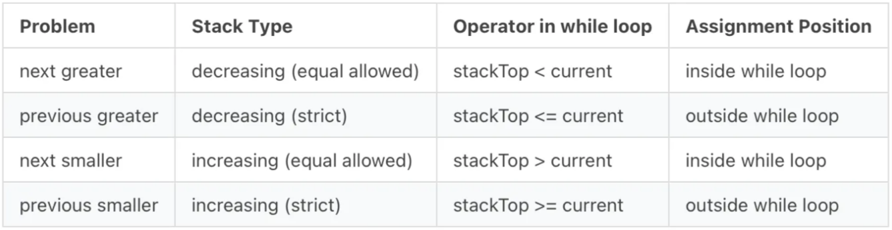

# Application :


## Remembering Code Trick :



1. Previous Smaller / Greater

```cpp
vector<int> prevSmaller(const vector<int>& a) {
    int n = a.size();
    vector<int> res(n, -1); // -1 if no previous smaller
    stack<int> st;
    for (int i = 0; i < n; i++) {
        while (!st.empty() && a[st.top()] >= a[i]) {
            st.pop(); // change >= to <= for prev greater
        }
        if (!st.empty()) {
            res[i] = st.top();
        }
        st.push(i);
    }
    return res;
}
```

2. Next Smaller / Greater

```cpp
vector<int> nextSmaller(const vector<int>& a) {
    int n = a.size();
    vector<int> res(n, n);
    stack<int> st;
    for (int i = 0; i < n; i++) {
        while (!st.empty() && a[i] < a[st.top()]) {
            res[st.top()] = i;
            st.pop();
        }
        st.push(i);
    }
    return res;
}
```

[D. Imbalanced Array](https://codeforces.com/contest/817/problem/D)

```cpp
#include<bits/stdc++.h>
using namespace std ;

#define int long long
signed main()
{
    ios_base::sync_with_stdio(false);
    cin.tie(nullptr);

    int n ; cin >> n ;
    vector<int> v(n);
    for ( int i = 0 ; i < n ; i++ ){
        cin >> v[i];
    }

    // ∑(mx-mn) = (∑mx ) - (∑mn)

    // (∑mn)
    vector<int>prv_s(n , -1) , nxt_s (n , n); // previous smaller , next smaller
    stack<int>st;
    for ( int i = 0 ; i < n ; i++ ){
        while( !st.empty() && v[st.top()] >= v[i]){
            st.pop();
        }
        if (!st.empty()){
            prv_s[i] = st.top();
        }
        st.push(i);
    }
    while ( !st.empty()){
        st.pop();
    }

    for ( int i = 0 ; i < n ; i++ ){
        while(!st.empty() && v[st.top()] >= v[i]){
            nxt_s[st.top()] = i ;
            st.pop();
        }
        st.push(i);
    }
    while ( !st.empty()){
        st.pop();
    }

    int mn_sum = 0 ;
    for ( int i = 0 ; i < n ; i++ ){
        int l_cnt = i - prv_s[i];
        int r_cnt = nxt_s[i] - i;

        mn_sum += v[i] * 1ll * l_cnt * r_cnt;
    }

    // (∑mx )
    vector<int>prv_g(n , -1) , nxt_g (n , n); // previous smaller , next smaller
    for ( int i = 0 ; i < n ; i++ ){
        while(!st.empty() && v[st.top()] <= v[i]){
            st.pop();
        }
        if ( !st.empty()){
            prv_g[i] = st.top();
        }
        st.push(i);
    }
    while ( !st.empty()){
        st.pop();
    }

    for ( int i = 0 ; i < n ; i++ ){
        while ( !st.empty() && v[st.top()] <= v[i] ){
            nxt_g[st.top()] = i ;
            st.pop();
        }
        st.push(i);
    }
    int mx_sum = 0 ;
    for ( int i = 0 ; i < n ; i++ ){
        int l_cnt = i - prv_g[i];
        int r_cnt = nxt_g[i] - i;

        mx_sum += v[i] * 1ll * l_cnt * r_cnt;
    }

    // ∑(mx-mn)
    cout << mx_sum - mn_sum << '\n';
    return 0 ;
}
```
