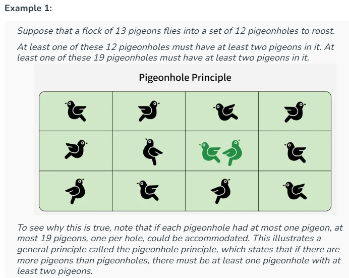

# Pigeonhole Principle :

The pigeonhole principle states that if n items are put into m containers, with n > m, then at least one container must contain more than one item.

## Resources :

[Article 01](https://www.geeksforgeeks.org/engineering-mathematics/discrete-mathematics-the-pigeonhole-principle/)

## Some interesting fact :

1. If i have an array of n length, and i want to find is there any e element exist , those deffrences will divisible by n-1 or not. The ans is always YES.  
   Reason : At least two numbers must have the same remainder modulo n-1.
