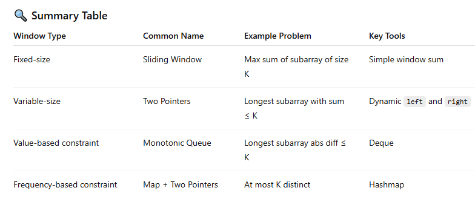

## Sliding Window Application :



1. Max sum of subarray of size K

```cpp
#define int long long
int maxSumSubarrayOfSizeK(const vector<int>& a, int k) {
    int sum = 0 , mx = LLONG_MIN;
    int n = a.size() ;

    for ( int i = 0 ; i < k ; i++ ){
        sum += a[i];
    }
    mx = max( mx , sum );
    for ( int i = k ; i < n ; i++ ){
        int out = a[i-k];
        int in = a[i];
        sum -= out;
        sum += in;
        mx = max(mx , sum);
    }
    return mx;
}
```

2(i). Longest Subarray with Sum ≤ K (Variable Window / Two Pointers)[pos value only]

```cpp
int longestSubarraySumLEK(const vector<int>& a, long long k) {
    int n = a.size();
    int left = 0, ans = 0;
    long long sum = 0;

    for (int right = 0; right < n; right++) {
        sum += a[right];
        while (sum > k) {
            sum -= a[left];
            left++;
        }
        ans = max(ans, right - left + 1);
    }
    return ans;
}
```

2(ii). Longest Subarray with Sum ≤ K (Variable Window / Two Pointers)[both pos & neg]

```cpp
int getLongestSubarray(vector<int>& a, int k) {
    int n = a.size();

    map<int, int> preSumMap;
    int sum = 0;
    int maxLen = 0;
    for (int i = 0; i < n; i++) {
        sum += a[i];

        if (sum == k) {
            maxLen = max(maxLen, i + 1);
        }

        int rem = sum - k;

        if (preSumMap.find(rem) != preSumMap.end()) {
            int len = i - preSumMap[rem];
            maxLen = max(maxLen, len);
        }

        if (preSumMap.find(sum) == preSumMap.end()) {
            preSumMap[sum] = i;
        }
    }
    return maxLen;
}
```

3. Longest Subarray with |max - min| ≤ K (Monotonic Deque)

```cpp
#define int long long
int longestSubarrayAbsDiffLEK(const vector<int>& a, int k) {
    deque<int> mx, mn;
    int l = 0, ans = 0;
    int n = a.size();

    for (int r = 0; r < n; r++) {

        // inserting decresing order
        while (!mx.empty() && a[mx.back()] < a[r]) {
            mx.pop_back();
        }
        mx.push_back(r);

        // inserting incresing order
        while (!mn.empty() && a[mn.back()] > a[r]) {
            mn.pop_back();
        }
        mn.push_back(r);

        while (a[mx.front()] - a[mn.front()] > k) {
            if (mx.front() == l) mx.pop_front();
            if (mn.front() == l) mn.pop_front();
            l++;
        }
        ans = max(ans, r - l + 1);
    }
    return ans;
}
```

4. Longest Subarray (or Substring) with At Most K Distinct Elements

```cpp
int longestSubarrayAtMostKDistinct(const vector<int>& a, int k) {
    map<int, int> freq;
    int left = 0, ans = 0;

    for (int right = 0; right < (int)a.size(); right++) {
        freq[a[right]]++;

        while ((int)freq.size() > k) {
            freq[a[left]]--;
            if (freq[a[left]] == 0){
                freq.erase(a[left]);
            }
            left++;
        }
        ans = max(ans, right - left + 1);
    }
    return ans;
}
Time complexity : O(nlogn)
But if we need to solve it in O(n), we can use Unorder map with custome hash
```
